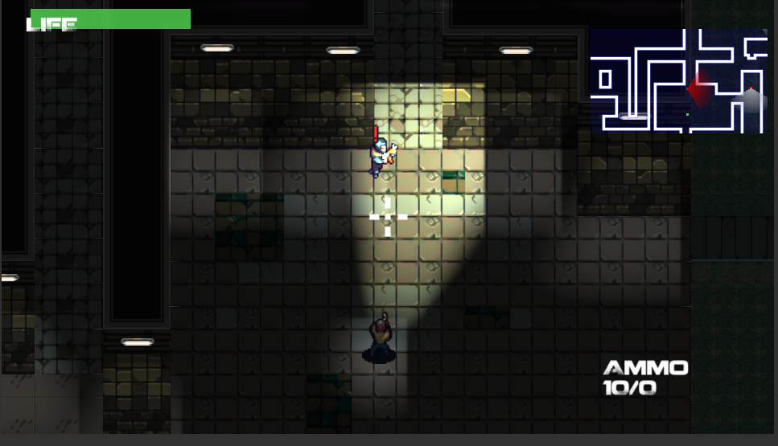

# StealthGame-Demo

## Description
This is the demo of my scripts for the StealthGame Demo project. I participated this team during February 2020 and I felt lucky to be a part of a professional team, developing a Metal Gear Solid Vibe Game. 

## Features
* Guards search for puddle sound made by player
* Guards search for lockers to find players
* Guards shoot player and coordinate with other guards to chase player
* Loosely-coupled classes with Zenject
* Minimal coding idealogy with Panda Behavior Tree

## Challenges
* This is the first time I joined such a professional small team for game dev and since the project has been well-developed, it took me sometime to catch up with the advanced scripts. Thanks to several meetings and researches, it was not challenging for me to catch up after a week and a half. This project also taught me how to read documentation and understood about FlowChart AI system as well.
* Secondly, I first learned about Zenject Dependencies Injection since this project. It was a hard concept at first because of my habbit of using SerializeField unecessary multiple times on different objects or Singleton. The concept is super great and I had a fun time learning through Youtube video and tested through the project itself.
* Thirdly, I learned about Panda Behaviour Tree through this project and the Software Team Lead has taught me how to use it properly. Luckily, it's coding style is similar to Python and the minal codings make it convenient to use as a part of the State Machines for Guards AI.

## Programming Language
C#

## Major Components
* Unity
* Zenject
* Panda Behaviour Tree

## Innovation
To be announced

## Project Information
* Source: not released
* Online access: not released
* Demo scripts: https://github.com/tieuchanlong/StealthGame-Demo
